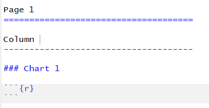

<style>
.column-left{
  float: left;
  width: 50%;
  text-align: left;
}

.column-right{
  float: right;
  width: 50%;
  text-align: right;
}
</style>

---

```{r setup, include=FALSE}
knitr::opts_chunk$set(echo = FALSE)
```

## INDEX

### - Structure of a dashboard.

### - Static dashboard.

### - Dynamic dashboard.

> Note: The content of this presentation has been obtained from the websites [R Markdown from RStudio](https://rmarkdown.rstudio.com/lesson-12.html) , [Flexdashboard for R](https://rmarkdown.rstudio.com/flexdashboard/index.html) and [R Markdown: The Definitive Guide](https://bookdown.org/yihui/rmarkdown/dashboards.html).

## FLEXDASHBOARD

Dashboards are a useful way to communicate large amounts of information visually and quickly. Create one with the **flexdashboard::flex_dashboard** output format, as in the **.Rmd** file.

Flexdashboard makes easy to organize your content into a visual layout:

<div class="column-left">
- Each Level 1 Header (#) begins a new **page** in the dashboard.     
- Each Level 2 Header (##) begins a new **column**.     
- Each Level 3 Header (###) begins a new **box**.     
</div>

<div class="column-right">
 
</div>         

## FEATURES:

- Use R Markdown to publish a group of related data visualizations as a dashboard.

- Support for a wide variety of components including html widgets; base, lattice, and grid graphics; tabular data; gauges and value boxes; and text annotations.

- Flexible and easy to specify row and column-based layouts. Components are intelligently re-sized to fill the browser and adapted for display on mobile devices.

- Storyboard layouts for presenting sequences of visualizations and related comments.

- Optionally use Shiny to drive visualizations dynamically.

## LAYOUT

There are many examples of layouts in [Flexdashboard for R](https://rmarkdown.rstudio.com/flexdashboard/layouts.html#overview).

Many of them must be added to the *Rmarkdown yaml-header*.

One could set the design:     
- in rows **orientation: rows**,      
- or in columns **orientation: columns**.        

Furthermore, you can decide if you want:
- to fit the content in a page,
- or to use scrolling websites **vertical_layout: scroll**.    

Other possibility is to create a storyboard  **storyboard: true**.

For Shiny features, **runtime: shiny** must be added. Then, we can include a sidebar by **Sidebar {.sidebar}**:
- global at the level of the **page**,
- or local at the level of the **row** or **column**.      

Also, it is possible to create tabs:
- in rows, when define a new one,  **Row {.tabset .tabset-fade}**, 
- in columns, when define a new one,  **Column {.tabset}**.  

## - STRUCTURE OF DASHBOARD

- [Template of RStudio](Examples/FD_00_Template_RStudio.Rmd)...[(view)](html/FD_00_Template_RStudio.html)
- [Template by rows](Examples/FD_01_Template_by_rows.Rmd)...[(view)](html/FD_01_Template_by_rows.html)
- [Template with Tabs](Examples/FD_02_Template_with_Tabs.Rmd)...[(view)](html/FD_02_Template_with_Tabs.html)
- [Template with Pages](Examples/FD_03_Template_with_Pages.Rmd)...[(view)](html/FD_03_Template_with_Pages.html)
- [Template with Storyboard](Examples/FD_04_Template_with_StoryBoard.Rmd)...[(view)](html/FD_04_Template_with_StoryBoard.html)
- [Template with Shiny](Examples/FD_05_Template_with_Shiny.Rmd)...[(view)](images/FD_05_Template_with_Shiny.png)

> Note: All of this examples has been obtained from the website [Flexdasboard for R](https://rmarkdown.rstudio.com/flexdashboard/index.html).

## VALUE BOXES

If you add the next R code, a value box is displayed.

```{r eval=FALSE, echo=TRUE}
### Primary
NumsWifi = 10
valueBox(NumsWifi, icon = "fa-wifi", color="primary")
```

There are five colors that correspond to the text:     
- blue  -> **primary**,     
- violet -> **info**,     
- gray -> **success**,     
- orange -> **warning**,     
- Red -> **danger**.     

   

## GAUGES

The next code produces a gauge (Shiny is needed, **runtime: shiny**).    

```{r eval=FALSE, echo=TRUE}
### Contact Rate
gauge(91, min = 0, max = 100, symbol = '%', gaugeSectors(
  success = c(80, 100), warning = c(40, 79), danger = c(0, 39)
))
```

There are three colors that correspond to the text:     
- green -> **success**,     
- orange -> **warning**,     
- Red -> **danger**.     

      


## - STATIC DASHBOARD

- [Ex 1 page 4 boxes](Examples/FDS_00_Ex_1_pages_4_boxes.Rmd)...[(view)](html/FDS_00_Ex_1_pages_4_boxes.html)
- [Ex 4 pages + barplot](Examples/FDS_01_Ex_4_pages_barplot.Rmd)...[(view)](html/FDS_01_Ex_4_pages_barplot.html)
- [Ex 4 pages + ggplot](Examples/FDS_02_Ex_4_pages_ggplot.Rmd)...[(view)](html/FDS_02_Ex_4_pages_ggplot.html)
- [Ex 5 pages + alluvial Gray](Examples/FDS_03_Ex_5_pages_alluvial_G.Rmd)...[(view)](html/FDS_03_Ex_5_pages_alluvial_G.html)
- [Ex 6 pages + alluvial Color](Examples/FDS_04_Ex_6_pages_alluvial_C.Rmd)...[(view)](html/FDS_04_Ex_6_pages_alluvial_C.html)
- [Ex 7 pages + heatmap](Examples/FDS_05_Ex_7_pages_heatmap.Rmd)...[(view)](images/FDS_05_Ex_7_pages_heatmap.png)
      

> Note: All of this examples has been obtained using data file [LogFile_corrected.csv](LogFile_corrected.csv) 

## SHINY (use)

Using Shiny with flexdashboard turns a **static** R Markdown report into an **Interactive** Document.     
It is important to note that **interactive** documents need to be deployed to **a Shiny Server** to be shared broadly (whereas static R Markdown documents are standalone web pages that can be attached to emails or served from any standard web server).     

> Note that the [**shinydashboard package**](https://rstudio.github.io/shinydashboard/) provides another way to create dashboards with Shiny.


## SHINY (How to Start)

The steps required to add Shiny components to a flexdashboard are as follows:

- Add **runtime: shiny** to the options declared at the top of the document (YAML front matter).

- Add the **{.sidebar}** attribute to the first column of the dashboard to make it a host for Shiny input controls (note this step is not strictly required, but many Shiny based dashboards will demand).

- Add **Shiny inputs** and **outputs** as appropriate.

- When including plots, be sure to wrap them in a call to **renderPlot**. This is important not only for dynamically responding to changes but also to ensure that they are **automatically re-sized** when their container changes.


## SHINY (Render functions)

You can use some of these render functions:

```{r eval=FALSE, echo=TRUE}
renderDataTable({ })

renderGauge({ })

renderImage({ }) 

renderPlot({ })

renderPlotly({ })

renderPrint({ })

renderSankeyNetwork({ })

renderTable({ })

renderText({ })

renderUI({ }) 

renderValueBox({ })
```


## - DYNAMIC DASHBOARD

- [Ex 8 pages + Shiny](Examples/FDD_00_Ex_8_pages_Shiny.Rmd)...[(view)](images/FDD_00_Ex_8_pages_Shiny.png)
- [Ex 2 pages + Shiny + Select Data](Examples/FDD_01_Ex_2_pages_Shiny_Data.Rmd)...[(view)](images/FDD_01_Ex_2_pages_Shiny_Data.png)
- [Ex 2 pages + Shiny + Select Data + heatmap](Examples/FDD_02_Ex_2_pages_Shiny_Data_heatmap.Rmd)...[(view)](images/FDD_02_Ex_2_pages_Shiny_Data_heatmap.png)     
       
             
             

> Note: All of this examples has been obtained using the data file [LogFile_corrected.csv](LogFile_corrected.csv) 

## Thanks!!!   


  